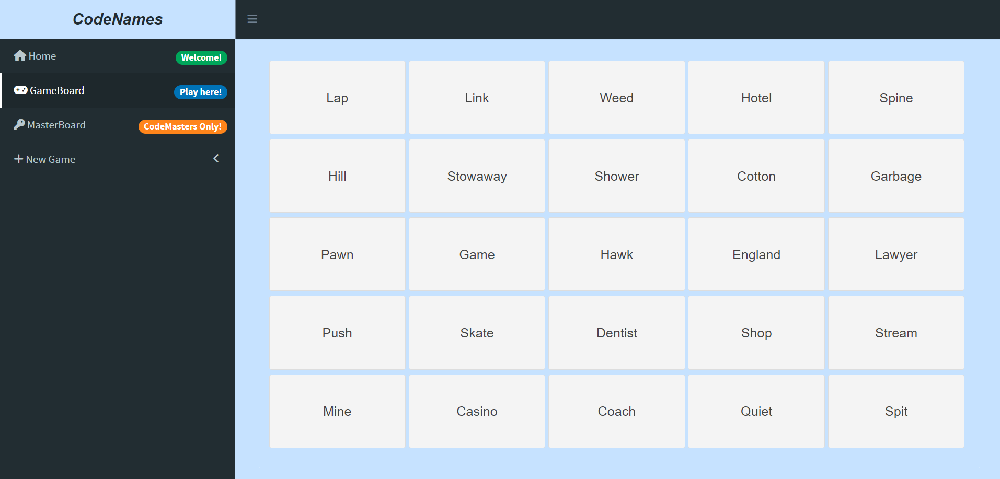
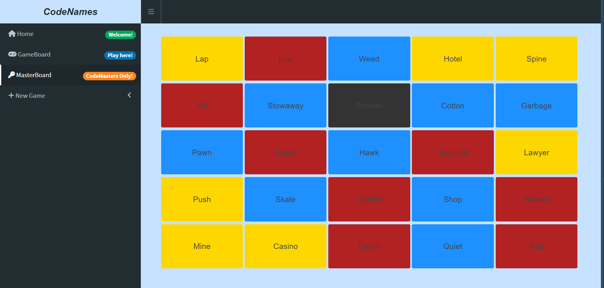

# 🔑 **CodeNames** 🔑 - *Zachary Pulliam* ☕

This repo contains R code to run an R Shiny dashboard in order to play the game CodeNames with your friends!

*Codenames is a 2015 party card game designed by Vlaada Chvátil and published by Czech Games Edition. Two teams compete by each having a "spymaster" give one-word clues that can point to multiple words on the board. The other players on the team attempt to guess their team's words while avoiding the words of the other team.*

## Example Session

## Setup

1. Install R and R Studio

2. Open R Studio and run one of the three R files to open the app.

## How to Play

1. Decide on two teams.

2. Select one team member from each team to be the CodeMaster.

3. Allow only the CodeMasters to view the MasterBoard.

4. The CodeMasters give one word clues associating to their words until all of a teams' words have been guessed.

5. Allow Blue to go first as they have one extra word.

6. Yellow words are unassigned; dont guess the assassin word!

7. Enjoy the game!

Official rules can be found [here](https://en.wikipedia.org/wiki/Codenames_(board_game)#:~:text=7%20External%20links-,Rules,of%20the%20team's%20agent%20tiles.).
